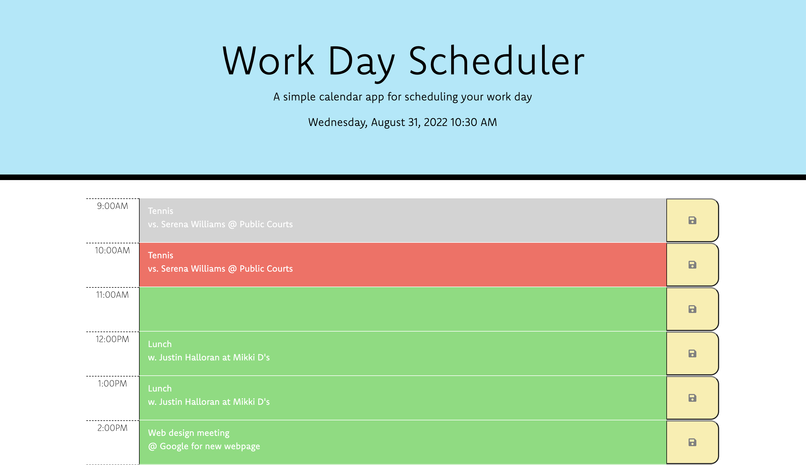
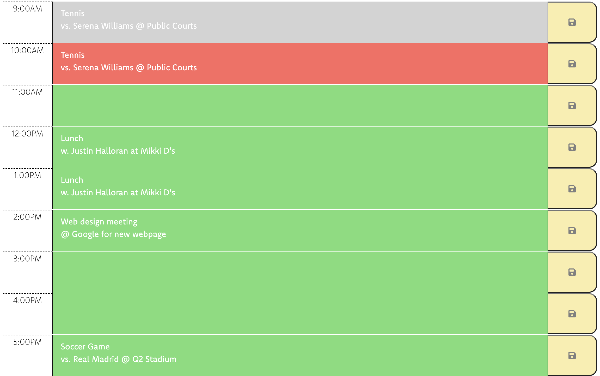
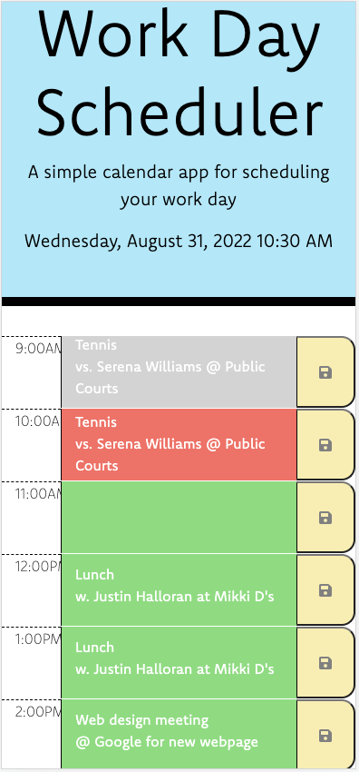

# Daily Organizer
A simple planner for your busy day!

# Objective
To have a website that saves events to local storage to organize your day. 

# Initial Behavior
- Website only displays a header. 

# Current Behavior
- Website displays the current day and time on the header. 
- Website displays time-blocks with business hours (9AM-5PM). 
- Website displays input text areas next to the time-blocks. 
- Website displays save button next to text areas. 
- Time-blocks are color coded in reference to the current time.
    - Past current time, grey.
    - Same as current time, red. 
    - Before current time, green. 
- Once there is an input in the text area and the user clicks the save button, the event will be saved even when the page is refreshed. 

# Links
Link to gitHub repo: https://github.com/ggggglo/Daily_Organizer

Link to deployed website: https://ggggglo.github.io/Daily_Organizer/

# Images
This is what the website looks like on desktop:

This is what the website looks like on mobile:

